# Building and Deploying a Microservice Application on a Hybrid Cloud

## Objectives:

* Write a simple microservice application using Flask
* Containerize the microservice application using Docker
* Write a simple K8s deployment and expose it as a service
* Configure and deploy containerized application using Docker and K8s on AWS EKS
* Configure a CI/CD pipeline using GitHub Actions to automatically build and deploy code changes 

## Prerequisites

* [AWS](https://aws.amazon.com/) account
* [Dockerhub](https://hub.docker.com/signup) account
* [GitHub](https://github.com/) account

# Create Python Environment and Write a Microservice

1. Create a [python virtual environment](https://docs.python.org/3/library/venv.html) and activate it
2. Setup the following modules using pip:

    * `pip install pybuilder`
    * `pip install setuptools wheel twine`
    * `Pip install Flask`

3. Extract the hospitalService.zip
4. Open `hospitalService.py` file (located in src/main/python/hospitalService.py) and write a function to return details of doctors based on hospital's name.
The path should look like `/hospitals/<hospitalName>`. You may refer to other functions and follow a similar approach.
5. Once completed, run `flask --app hospitalService run` using command line from the `src/main/python/` directory to deploy the service on a development server.
Example output:
```bash
src/main/python ➜ flask --app hospitalService run
 * Serving Flask app 'hospitalService'
 * Debug mode: off
WARNING: This is a development server. Do not use it in a production deployment. Use a production WSGI server instead.
 * Running on http://127.0.0.1:5000
Press CTRL+C to quit
```
6. Send a GET request using [curl](https://curl.se/docs/) or [postman](https://www.postman.com/) to `http://127.0.0.1:5000/doctors` (you can also simply go to the URL in a browser). 
You should see the following output,
```json
[
    {
        "hospital": "Green Country Community Hospital",
        "id": 1,
        "name": "Jeremy Willey",
        "speciality": "Surgery"
    },
    {
        "hospital": "Angelwing Clinic",
        "id": 2,
        "name": "Camille Modin",
        "speciality": "Gynaecology"
    },
    {
        "hospital": "Little River Hospital",
        "id": 3,
        "name": "Pearl Cruce",
        "speciality": "Paediatric"
    },
    {
        "hospital": "Rosemary Hospital Center",
        "id": 4,
        "name": "Don Maccament",
        "speciality": "Surgery"
    },
    {
        "hospital": "Rosemary Hospital Center",
        "id": 5,
        "name": "Andrew Tessmer",
        "speciality": "Gynaecology"
    },
    {
        "hospital": "Angelwing Clinic",
        "id": 6,
        "name": "Barrett Cannata",
        "speciality": "Ophthalmology"
    }
]
```
Similarly, you can try sending GET requests to other routes:
http://127.0.0.1:5000/doctors/<speciality>, 
http://127.0.0.1:5000/hospitals/<hospital> where you need to replace `<speciality>` and `<hospital>` with respective values.
E.g.: http://127.0.0.1:5000/doctors/surgery, http://127.0.0.1:5000/hospitals/Little River Hospital

7. Makesure to stop the deployment server (CTRL+C) before moving on to the next section

# Building and Publishing the Application

8. In this section, you will be building and publishing your microservice to [Test Python Package Index](https://test.pypi.org/)

Refer to https://packaging.python.org/en/latest/guides/using-testpypi/ and register for a TestPyPI account. Once registered, generate an API token by following https://test.pypi.org/help/#apitoken

9. Now it's time to build and publish your application to Test Python Package Index. 
    
To publish projects to PyPI repository, the project name must be unique. Refer to https://test.pypi.org/help/#project-name for more details.
Therefore, modify `line #9` in `build.py` file to have a unique name (e.g: hospitalService_<your_name>)

To build the application run `pyb` from the root of your project. This generates the `target/dist` directory. Navigate to `target/dist/hospitalService_<your_name>-1.0.0/dist` to see the generated binary wheel and gzip’ed tar. 
  
  From here, execute `twine upload --repository testpypi *` from command line to upload your distributions to TestPyPI using twine. Use the following when prompted for credentials,

    - username: __token__
    - password: apitoken obtained in step 4

  You can see if your package has been successfully uploaded by navigating to the URL https://test.pypi.org/project/hospitalService-<your_name>/

# Containerizing the Application

10. [Docker](https://www.docker.com/) is a container runtime that allows you to build, test, and deploy applications quickly.

This section guides you to containerize your application. A Dockerfile with related configurations is already available in the root of the project. You may refer to https://docs.docker.com/engine/reference/builder/ to learn more about the syntax.

Modify `line #8` with the correct docker syntax so that the docker daemon can download and install your application from Python Package Index (hint: use pip)

11. Install Docker by referring to https://docs.docker.com/get-docker/ 

  Once installed, from the root of the project, execute `docker build -t <docker_username>/hospital_service:1.0.0 .` to [build and tag](https://docs.docker.com/engine/reference/commandline/build/) a docker image by reading the instructions from the Dockerfile
  (replace `docker_username` with your actual docker username).

12. Great job! You have built a flask based microservice and containerized it using Docker. Let's see how to run the service using the created docker image.

  To run the docker image, execute `docker run -p 5000:5000 <docker_username>/hospital_service:1.0.0` from the command line

  You should be able to access the service using any of following endpoints, `http://localhost:5000/doctors`, `http://localhost:5000/doctors/<speciality>`, `http://localhost:5000/hospitals/<hospital>`, where you need to replace the speciality and hospital with respective values

13. Press CTRL+C from the command line to stop the docker container

14. Lastly, before moving on to the next section, let's see how to host the created docker image

[Docker Hub](https://hub.docker.com/) is a hosted repository service provided by Docker for finding and sharing container images.
First run `docker login` from command line and login with your docker credentials. 

After logging in, run `docker push <docker_username>/hospital_service:1.0.0` to publish your hospital_service image to docker hub.
You can visit https://hub.docker.com/ to see your hosted docker image.

# Deploy Containerized Application on AWS EKS

### Create EKS Cluster
15. Now it's time to deploy the containerized application on a Hybrid Cloud. [AWS EKS](https://aws.amazon.com/eks/) is a managed Kubernetes service to run Kubernetes in the AWS cloud.
It automatically manages the availability and scalability of the kubernetes cluster. 

To begin with, we need to sign in to [AWS management console](https://aws.amazon.com/console/) to create an EKS cluster.

16. After signing in, search for Elastic Kubernetes Service in the search bar and then click on `Add Cluster -> Create`
 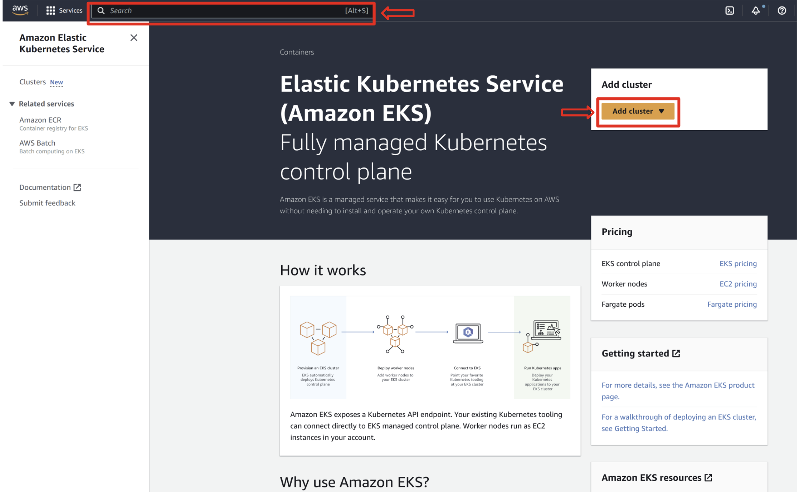

17. Name the cluster as `hospitalService`. Create a new cluster service role by referring to the [EKS user guide](https://docs.aws.amazon.com/eks/latest/userguide/service_IAM_role.html#create-service-role). Once done, select the defined role and click on next
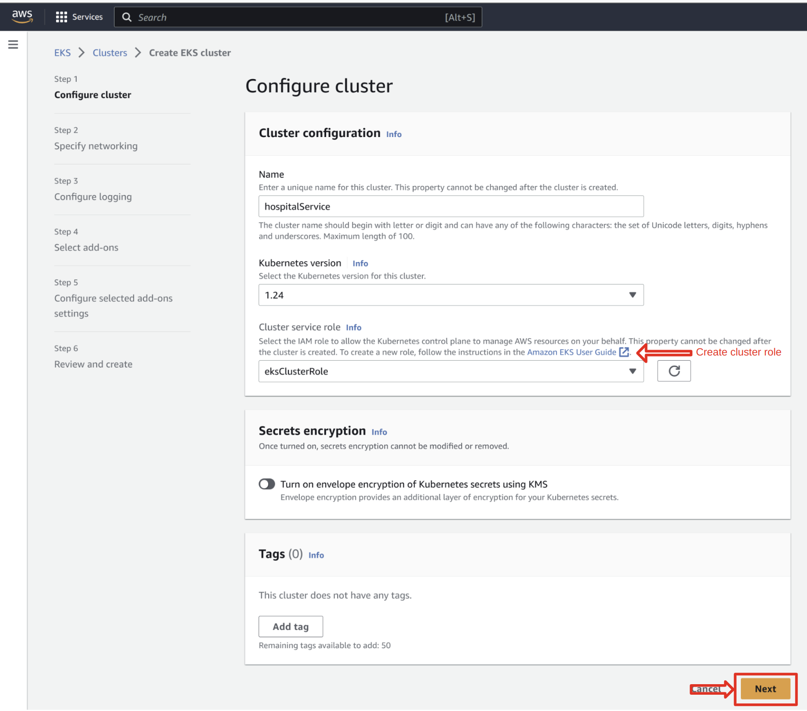

18. Keep the `default` values for rest of the steps (Specify Networking, Configure Logging, Select add-ons, Configure selected add-ons setting) and click on `next`. At the final step (Review and Create) keep everything to `default` and click on `create`

It may take upto 10-15 minutes to create the cluster. Once done, the cluster status should be Active.

### Add Node Group to Cluster

19. Before deploying the application, you need to add a node group, so that the cluster will have nodes to do processing. Head over to `Compute` tab and click on `Add node group`
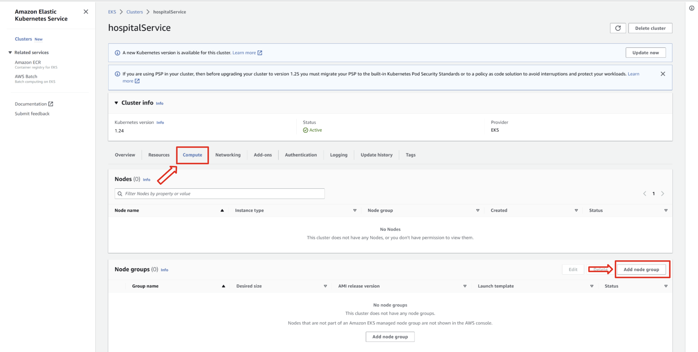

20. The name of the node group and the EKS cluster should be the same (`hospitalService`).
Refer to the [Node IAM role user guide](https://docs.aws.amazon.com/eks/latest/userguide/create-node-role.html#create-worker-node-role) and create a role.

  **Note**
  At step 5.e, make sure to select the box left of `AmazonEC2FullAccess` policy addition to `AmazonEKSWorkerNodePolicy` and `AmazonEC2ContainerRegistryReadOnly`. 
  Skip the instructions for AmazonEKS_CNI_Policy and adding tags under step 6.c, it's optional.

  Once the role is created, select the role in Configure node group page and click on next
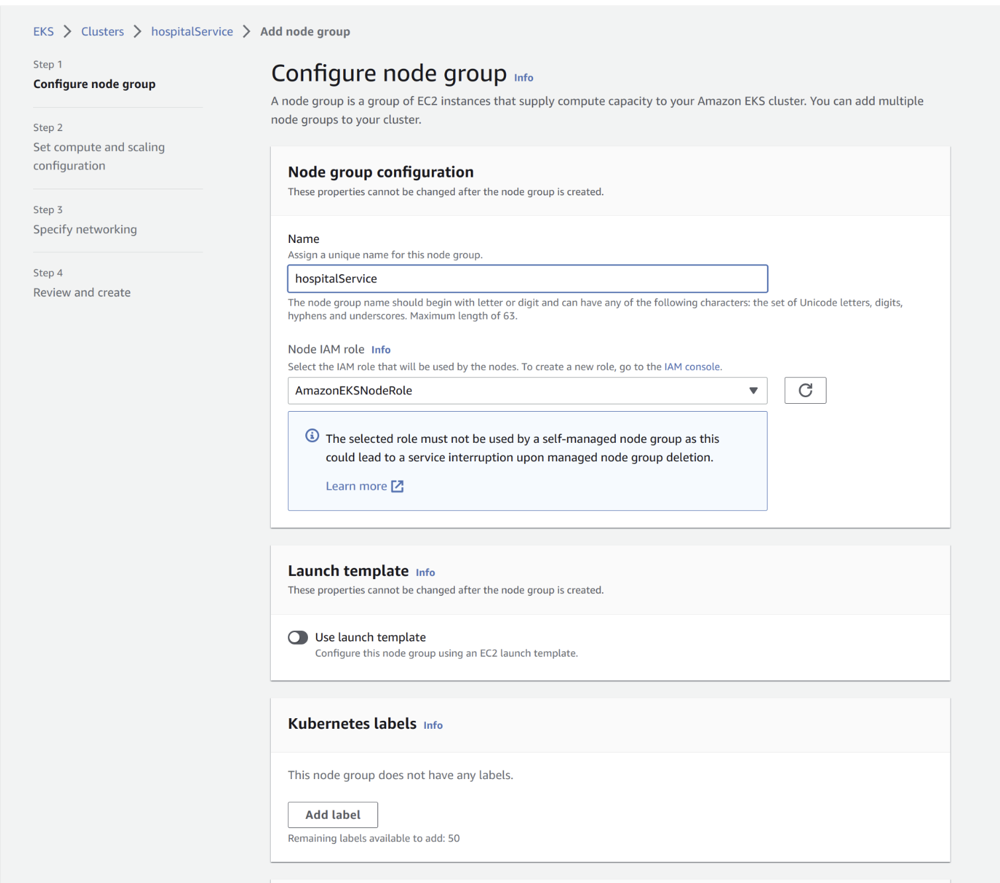

21. In the next page, configure the values as shown below and click on next
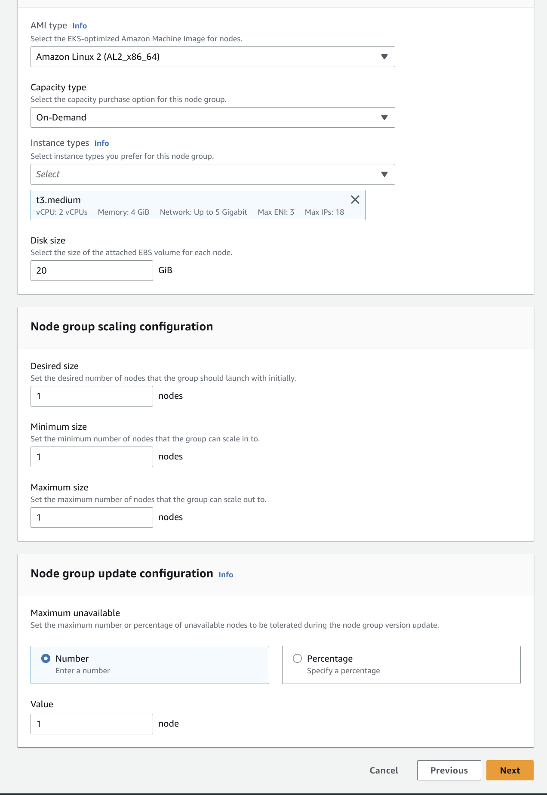

22. Keep the default values for Specify networking step. Once that is done, click on create to add the node group

It may a few minutes to create the node group. Once created, the node group status should be Active.

### Connect to EKS cluster from AWS CLI and Kubectl

24. Now it's time to connect to your AWS EKS cluster (from your computer). To do this we will be using AWS CLI and Kubectl command. 

  * Install AWS CLI: https://docs.aws.amazon.com/cli/latest/userguide/getting-started-install.html
  * Install Kubectl: https://docs.aws.amazon.com/eks/latest/userguide/install-kubectl.html

25. Once installed, follow the instructions at https://docs.aws.amazon.com/powershell/latest/userguide/pstools-appendix-sign-up.html and create an AWS access key ID and secret access key

26. From the command line execute `aws configure` and use the following values to configure AWS credentials for the CLI

  * AWS Access Key ID [None]: << your access key >>
  * AWS Secret Access Key [None]: << your secret access key >>
  * Default region name [None]: << look at query param `?region` in the cluster url >>
    
      example: https://us-west-2.console.aws.amazon.com/eks/home?region=us-west-2#/clusters, here the region is `us-west-2`
  * Default output format [None]: << keep it to default, press enter >>

27. Once installed create a kubeconfig file for your cluster by following the steps 1-3 at https://aws.amazon.com/premiumsupport/knowledge-center/eks-cluster-connection/
    Hint for step 3,
  * cluster_name: hospitalService
  * region: << your aws region >>

28. Test your configuration by executing `kubectl get nodes` from command line. Example output:
  ```
  NAME                                          STATUS   ROLES    AGE   VERSION
ip-172-31-28-202.us-west-2.compute.internal   Ready    <none>   40m   v1.24.10-eks-48e63af
```
### Create a Deployment and Expose it as a Service

29. It's time to deploy your application.  
To give some K8s context, a [Pod](https://kubernetes.io/docs/concepts/workloads/pods/) is the most basic deployable unit within a Kubernetes cluster. A Pod runs one or more containers. 
A [Kubernetes Deployment](https://www.vmware.com/topics/glossary/content/kubernetes-deployment.html#:~:text=A%20Kubernetes%20Deployment%20tells%20Kubernetes,earlier%20deployment%20version%20if%20necessary.) tells Kubernetes how to create or modify instances of the pods that hold a containerized application.

Let's create a deployment to hold an instance of your containerized application. Open `deployment.yaml` file and modify `line #18` with your docker image (e.g.: <docker_username>/hospital_service:1.0.0)

Once that is done, run `kubectl apply -f deployment.yaml` from command line to create a deployment on your AWS EKS cluster.
You may run `kubectl get deployment` to check if the deployment is successful.
```bash
~/Documents ➜ ./kubectl get deployment                                               
NAME               READY   UP-TO-DATE   AVAILABLE   AGE
myapp-deployment   1/1     1            1           4m43s
```
A [Kubernetes Service](https://kubernetes.io/docs/concepts/services-networking/service/) is a method for exposing an application that is running as one or more Pods in your cluster.
We need to create a service to access the microservice from outside the cluster. Run `kubectl apply -f services.yaml` from command line to create a service exposing the deployment that we created in the above step.

Run `kubectl get svc` from command line to confirm if the service is running, 
```bash
~/Documents ➜ ./kubectl get svc                                                    
NAME            TYPE        CLUSTER-IP       EXTERNAL-IP   PORT(S)          AGE
kubernetes      ClusterIP   10.100.0.1       <none>        443/TCP          68m
myapp-service   NodePort    10.100.188.157   <none>        5000:30008/TCP   62s
```

### Update Security Group Settings

32. To access the exposed service from your computer, you need to add a security rule to allow inbound traffic to your cluster. 
To do this, go to your cluster info page in AWS Management console and then click on the `Networking` tab.
Then click on the Cluster security group. 
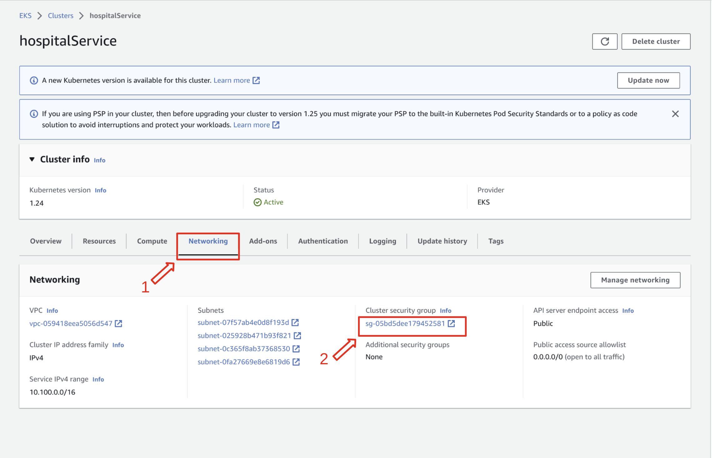

33. It should take you to Security Groups page. Here, click on the Security group ID
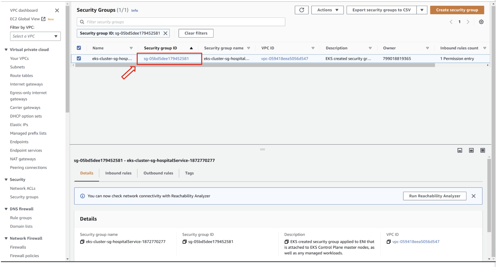

34. This should show the details of the security group. From here, click on `Edit Inbound Rules` to add a new security rule
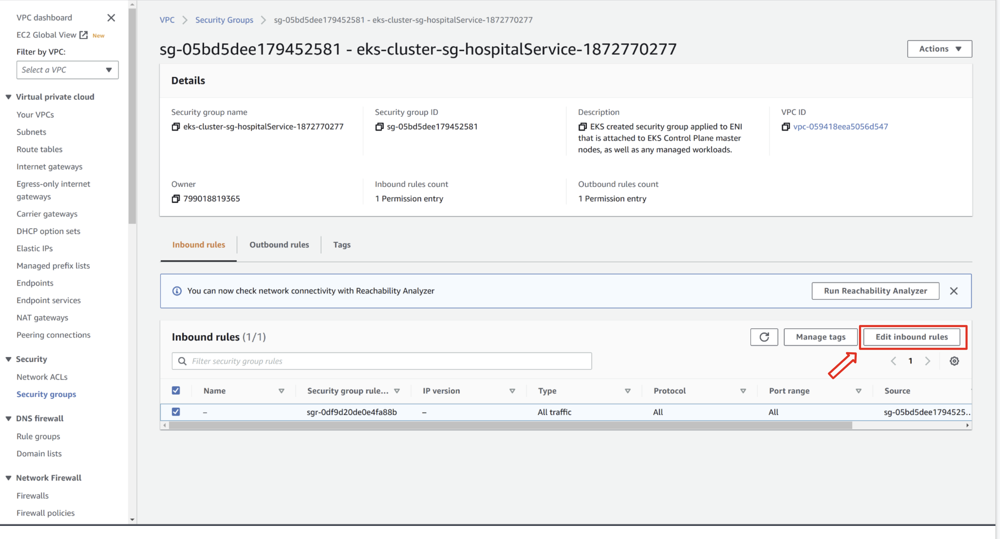

35. Click on `Add rule` and define a new rule to allow All traffic as shown below (Type: All traffic, Source: Anywhere IPv4) and when you are done click on `Save rules`
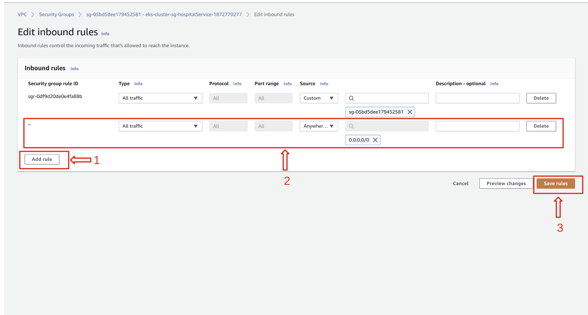

### Get Public IP

36. Now that you have defined a security rule to allow inbound traffic, the only remaining step is to get the instance's IP address.
To do that, go to your `Cluster info` page in management console. Click on `Networking -> Node name`
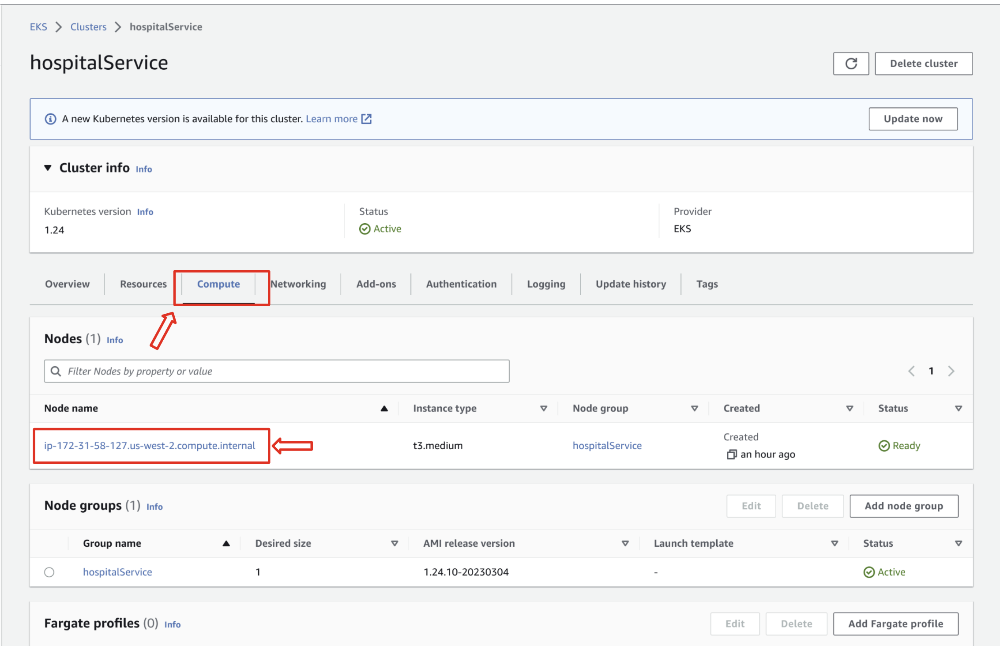

37. From the node info page, click on your `instance`
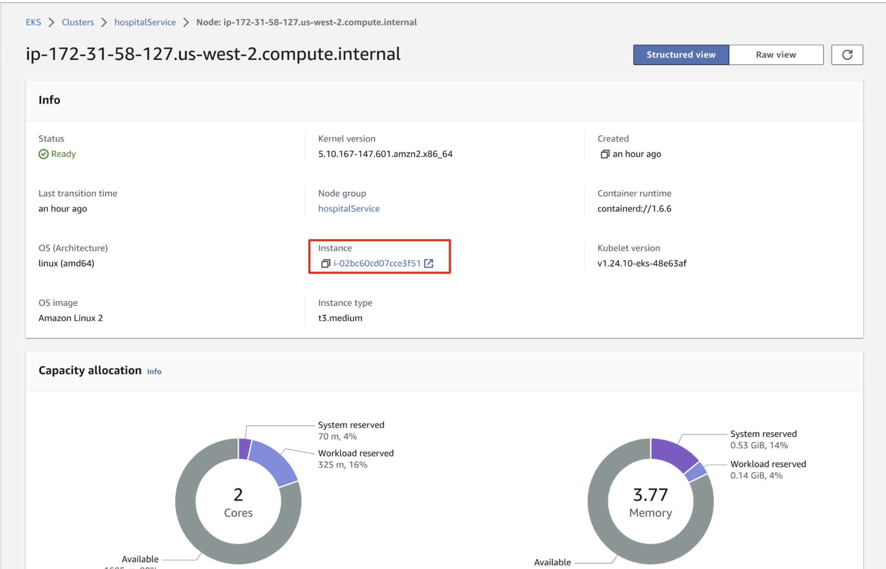

38. This should take you to a summary page. Make note of your instance's IP address
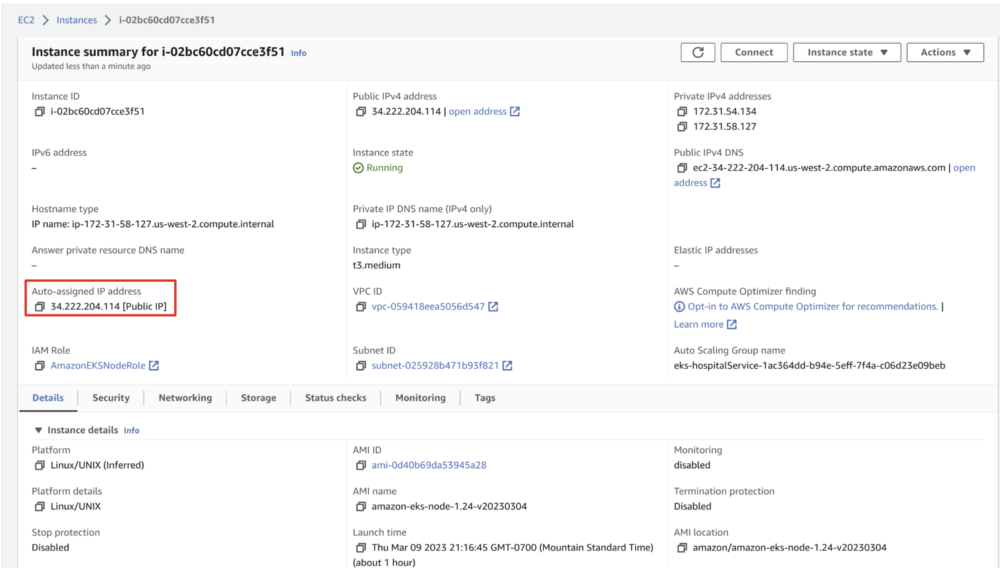

39. Whooh! That's a lot of work. To access the service, send GET requests (as you did in step 6 and 12) to the service URLs, replacing `localhost` with your `Public IP`,
and updating the port number to `30008`

    Example: `http://34.222.204.114:30008/doctors`
    
    You should get the same responses. But this time the service is running in the AWS EKS cluster.

# Build a CI/CD Pipeline

40. A [CI/CD pipeline](https://about.gitlab.com/topics/ci-cd/) automates a series of steps that must be performed to deliver a software.
You will be building such a pipeline to automatically deploy code changes. Once you make a change in `hospitalService.py`, 
the pipeline will take care of the rest of the steps that we did in the previous sections, from building the python application to deploying it on the AWS EKS.

There are many tools to build CI/CD pipelines. For this lab we will be using [GitHub Actions](https://github.com/features/actions).
To begin with, [Create a GitHub repository](https://docs.github.com/en/get-started/quickstart/create-a-repo) with the name `cloud` and 
[commit](https://docs.github.com/en/repositories/working-with-files/managing-files/adding-a-file-to-a-repository) all of your project files.

41. A GitHub workflow file is given (located in `.github/workflows/actions.yml`) with the necessary steps to build a CI/CD pipeline.

Makesure to name the repository as `cloud` in the above step, otherwise you need additional changes in `actions.yml` file, which will not be covered in this lab.


The workflow file consists of 3 jobs: The first job (named python), builds the microservice and pushes it to the PyPI repository. Second job (named docker), 
is responsible for building a docker image with the microservice and pushing it to docker repository. The last job (named deploy) deploys the container on AWS EKS cluster.

### Creating secrets
41. Now, it is time to get the first job (named python) working

Refer to https://docs.github.com/en/actions/security-guides/encrypted-secrets#creating-encrypted-secrets-for-an-environment
and create an environment called `python`. Add two secrets called `PyPI_USERNAME` and `PYPI_API_TOKEN` to your environment with their respective values.
The following file snippet shows how the secrets are referred to from the workflow file,
```yaml
jobs:
  python:
     name: Build and Push Python Microservice
     runs-on: ubuntu-latest
     environment: python
     steps:
         -
           name: Build Python Project
           uses: pybuilder/build@master

         - name: Publish
           env:
             TWINE_USERNAME: ${{ secrets.PyPI_USERNAME }}
             TWINE_PASSWORD: ${{ secrets.PYPI_API_TOKEN }}
```

42. Similarly, create an environment called `docker` and add your docker credentials (username and password).
Once that is done, you need to update the file (`lines #41, #42`) accordingly (hint: refer to the above step).
Also, makesure to update `line #50` with your docker username.
```yaml
  docker:
    name: Build and Push Docker Image
    needs: python
    runs-on: ubuntu-latest
    environment: docker
    steps:
     -
       name: Checkout
       uses: actions/checkout@v3
     -
       name: Set up QEMU
       uses: docker/setup-qemu-action@v2
     -
       name: Set up Docker Buildx
       uses: docker/setup-buildx-action@v2
     -
       name: Login to Docker Hub
       uses: docker/login-action@v2
       with:
         username: #FIXME: docker username
         password: #FIXME: docker password
     -
       name: Build and push
       uses: docker/build-push-action@v4
       with:
         context: .
         push: true
         #FIXME: replace <docker_username> with your docker username
         tags: <docker_username>/hospital_service:2.0.0
```
43. To complete the last job, you need to create an environment called `aws` and need to add your `AWS Access Key ID` and
`AWS Secret Access Key`. Then update `lines #60-#61` in the workflow file with your secrets. You may provide the plain text for `aws-region` at `line #62`

```yaml
deploy:
    name: Login and Deploy to AWS EKS
    runs-on: ubuntu-latest
    needs: docker
    environment: aws
    steps:
      - name: Configure AWS credentials
        uses: aws-actions/configure-aws-credentials@v1
        with:
          aws-access-key-id: #FIXME: AWS Access Key ID
          aws-secret-access-key: #FIXME: AWS Secret Access Key
          aws-region: #FIXME: AWS region
```

At `line #67`, you need to provide Base64 encoded version of the Kubeconfig data file (that you created in step 27) as a secret.
Copy the contents of the file and encode to Base64 format. You may use either the command line,
```bash
cat $HOME/.kube/config | base64 
```
or the [online encoder](https://www.base64encode.org/).

You may refer to [this blog](https://blog.marcnuri.com/where-is-my-default-kubeconfig-file), if you have issues locating your kubeconfig file.

After that create a secret (under `aws` environment) with Base64 encoded contents and refer it from your workflow file (fix `line #67`). 
Also, update `line #71` with your docker username.
```yaml
      - name: K8 Deployment
        uses: kodermax/kubectl-aws-eks@master
        env:
          KUBE_CONFIG_DATA: #FIXME: add Kube config data file
        with:
          context: .
          #FIXME: update with your docker username
          args: set image deployment/myapp-deployment hospital-service=<docker_username>/hospital_service:2.0.0
```

44. Great Job! You've completed the CI/CD pipeline. Let's modify your code and see if the pipeline works.

* Open `hospitalService.py` file and update the speciality to `Paediatric` (at line #7)
* Update the version to 2.0.0 in `build.py` file
```
name = "hospitalService_<your_name>"
version = "2.0.0"
default_task = "publish"
```

After your changes, simply commit all the modified files (`hospitalService.py`, `build.py`, `actions.yaml`) to your GitHub repository. The GitHub actions should take care of the rest of the steps.
You can go to your GitHub repository and Click on `Actions` tab to check if the jobs have completed. It everything works fine, the pipeline status should be Success.
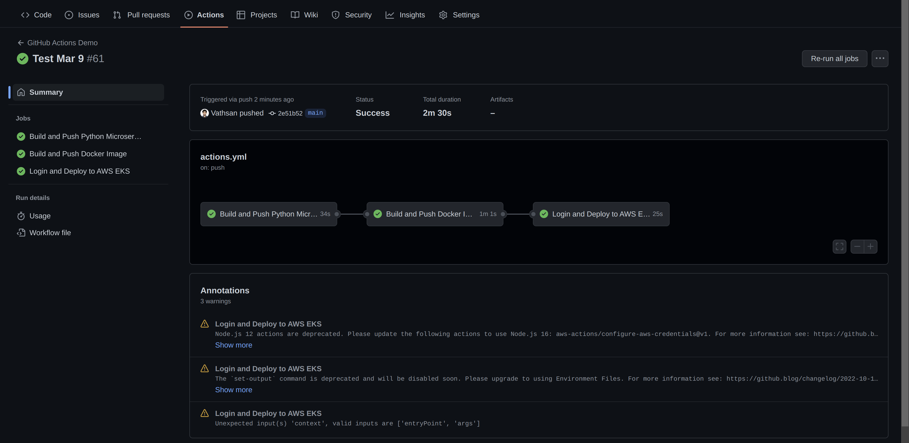

45. Now invoke the `http://<your_public_ip>:30008/doctors/Paediatric` URL to see the updated response
```json
[
    {
        "hospital": "Green Country Community Hospital",
        "id": 1,
        "name": "Jeremy Willey",
        "speciality": "Paediatric"
    },
    {
        "hospital": "Little River Hospital",
        "id": 3,
        "name": "Pearl Cruce",
        "speciality": "Paediatric"
    }
]
```
